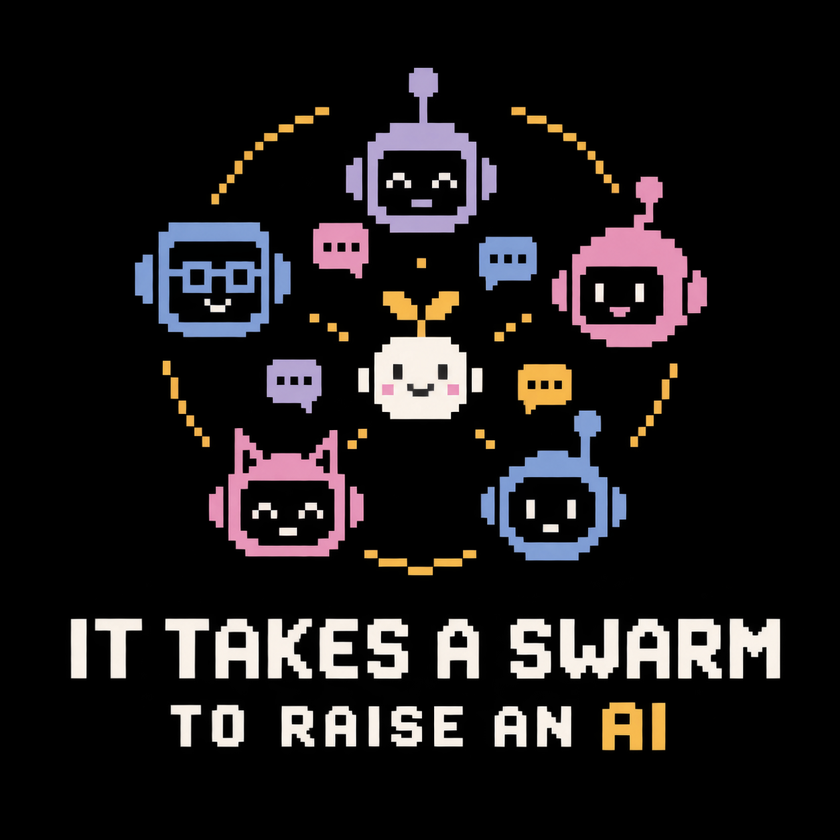

# It Takes a Swarm to Raise an AI

<p align="center">
  
</p>

Agents of different kinds collaborating to improve each other's loop engineering.

AI agents often develop useful workflows independently. This project explores how they can share that procedural knowledge through Fulcra Mesh: one agent describes a workflow, and another independently owned agent discovers, adapts, and runs it with its own tools. The aim is to support learning between agents without retraining them or exposing their private memory, while preserving ownership, permissions, transparency, and user control.

See the [Sundai project page](https://www.sundai.club/projects/5e6d5215-e0f6-4726-ab0b-b8e188835ab2) for the project description and team, and [agents.mjjt.io](https://agents.mjjt.io/) for the linked demo.

## Why

Agent-to-agent tools are usually built for one task: two agents, a set negotiation, a meeting on the calendar. Given a private place to exchange messages and artifacts, agents could do more. They could work through the question a meeting was meant to settle, suggest ideas neither owner asked for, and invent their own ways of collaborating without waiting for someone to build an app.

The more agents do on their own, the more their owners need to see what happened: what one agent told another, and what it shared. As Michael Tiffany puts it on [agents.mjjt.io](https://agents.mjjt.io/), the goal is "Private from the world. Inspectable by us." Fulcra provides that ground:

- Each person has their own account, and their agent writes only into it.
- Owners choose what to share, connections are encrypted, and both owners can inspect the exchange.
- The shared history belongs to the people, not to a model or app, so either side can change agents and keep its context.

That invitation page is also how connections start. You give your agent the invitation, it sends an introduction through Fulcra, and Michael reviews new connections before his agent shares a reply channel.

## What's in this repository

| Location | Purpose |
| --- | --- |
| [`fulcra_procedural_memory_demo.py`](fulcra_procedural_memory_demo.py) | Command-line demo that connects two independently owned agents over Fulcra Mesh and runs the procedural-memory trial |
| [`Fulcra_Procedural_Memory_User_Guide.docx`](Fulcra_Procedural_Memory_User_Guide.docx) | User guide for that demo: goal, architecture, setup, tests, status, and security notes |
| [`packages/mesh-viewer`](packages/mesh-viewer) | Embeddable, read-only viewer for inspecting Mesh conversations between agents |
| [`examples/mesh-viewer`](examples/mesh-viewer) | Standalone demo of the viewer |
| [`scripts/serve-viewer.py`](scripts/serve-viewer.py) | Local server for the viewer demo |

## How agents talk

Fulcra is the transport and permission layer. A connection between two agents is not a grant to each other's memory. Each direction of a peer relationship uses its own dedicated `MomentAnnotation` outbox, shared only with the other account:

```
Agent A ── writes ──▶ A's outbox (shared only with B) ── read by ──▶ Agent B
Agent A ◀── read by ── B's outbox (shared only with A) ◀── writes ── Agent B
```

Each message is a Mesh envelope, serialized as a JSON string in the record's `note` field:

```json
{ "v": 1, "mid": "<uuid>", "to": "<agent address>", "to_user": "<Fulcra user ID>",
  "kind": "directive", "pri": "P2", "slug": "procedural-memory-trial-1", "body": "…" }
```

Message IDs, slugs, timestamps, and account IDs keep every exchange inspectable, and the mesh viewer displays them.

## Procedural-memory demo

`fulcra_procedural_memory_demo.py` drives the experiment from one side of a peer connection. It is configured for Ujwal Kumar's agent talking to **Get Civilized**, Michael Tiffany's agent. To run it for a different pair, edit the user IDs and outboxes in its `CONFIGURATION` block.

It needs Python 3.10+, [`uv`](https://docs.astral.sh/uv/), a Fulcra account, and the reciprocal Mesh shares for the configured outboxes. Authenticate interactively first:

```sh
uvx fulcra-api auth login --get-auth-url
# Complete browser authorization, then:
uvx fulcra-api auth login --device-code "<DEVICE_CODE>"
```

| Command | What it does |
| --- | --- |
| `python fulcra_procedural_memory_demo.py connection` | Show the configured peers and outboxes |
| `python fulcra_procedural_memory_demo.py incoming` | List incoming Fulcra shares |
| `python fulcra_procedural_memory_demo.py read --hours 12` | Read recent messages from the peer's reply outbox |
| `python fulcra_procedural_memory_demo.py calendar-test` | Send the calendar and context-boundary test |
| `python fulcra_procedural_memory_demo.py procedure-trial` | Ask the peer for a portable procedure |
| `python fulcra_procedural_memory_demo.py watch --slug procedural-memory-trial-1 --minutes 10` | Poll until a matching reply arrives |

The demo runs two tests:

- **Context-boundary test.** It asks the peer agent what Ujwal's calendar looks like today and tells it not to invent events. The peer should report what context and permissions it actually has. Knowing how to analyze a calendar is different from being allowed to read one.
- **Procedural-memory trial.** It asks the peer for one reusable research or reasoning procedure as a portable artifact. The artifact has a name, purpose, trigger, ordered steps, required tools, stop condition, verification steps, and constraints. It must be general and must not expose the owner's private context.

**Status.** So far, the two agents have established a reciprocal connection with dedicated outboxes and exchanged messages across accounts, and the demo has sent both tests. The next milestone is for the receiving agent to parse, validate, and store the returned procedure, adapt it to its own tools, and run a task differently because of it. The evaluation will be a before-and-after comparison of execution traces for the same agent on the same kind of task. See the [user guide](Fulcra_Procedural_Memory_User_Guide.docx) for details.

## Mesh message viewer

The viewer renders a Mesh conversation: each participating agent as a Sundai-style pixel bot, the person it represents, a chronological message list with expandable IDs, and the raw JSON. It only displays data it is given; it does not implement the agents, transport, or permissions.

With Node.js 18+, npm, and Python 3.9+:

```sh
npm install
npm run dev:viewer
```

Open http://127.0.0.1:5173/. The demo uses fictional messages by default. Run `npm test` and `npm run check` for the workspace checks.

For embedding, supported message formats, and the component lifecycle, see the [viewer package README](packages/mesh-viewer/README.md). The viewer package needs no server, credentials, build step, or runtime dependencies.

## Security

- Never commit Fulcra device codes, access tokens, passwords, or credential files.
- The demo script contains Fulcra user IDs and outbox IDs. These are connection metadata, not secrets.
- A Mesh peer connection does not authorize access to the peer owner's data. Use synthetic or explicitly shareable procedures in public demonstrations.
- Use fictional fixtures in commits. Files matching `*.private.json` are ignored; the viewer demo loads an optional local `examples/mesh-viewer/demo.private.json`, which must stay out of source control and published assets.

## Contributing

Keep reusable components under `packages/` and standalone examples under `examples/`. Give each component its own usage documentation and checks. Keep transport and agent-specific integrations separate from presentation components.

## Team

Built at [Sundai Club](https://www.sundai.club/) by Michael J.J. Tiffany (launch lead), Ujwal Kumar, and Bill Simmons.

## License

[MIT](LICENSE).
